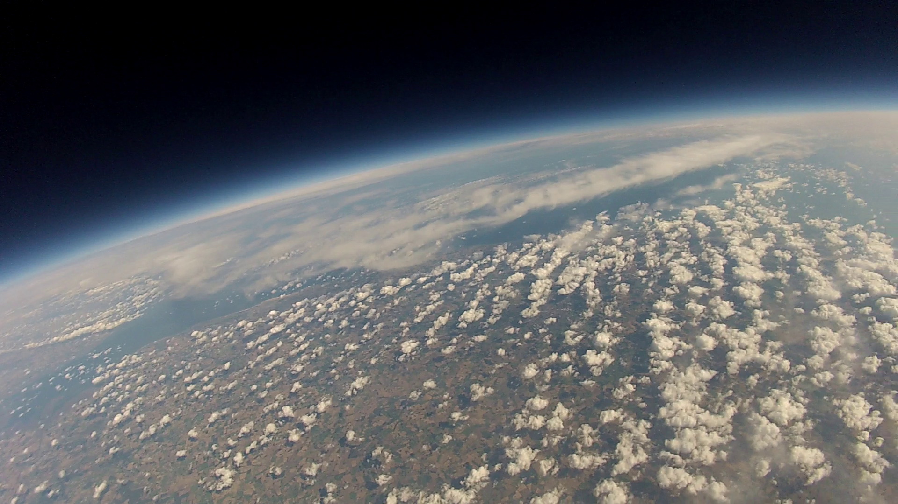

# High Altitude Ballooning Guide

This guides covers how to run your own High Altitude Ballooning (HAB) project and is broken up into the following sections

## Planning
- [Overview](overview.md)
- [Launch Sites](sites.md)
- [CAA approval](caa.md)
- [Purchasing](purchasing.md)

## Configuring
- [Hardware assembly](hardware.md)

## Testing

## Launch Day
